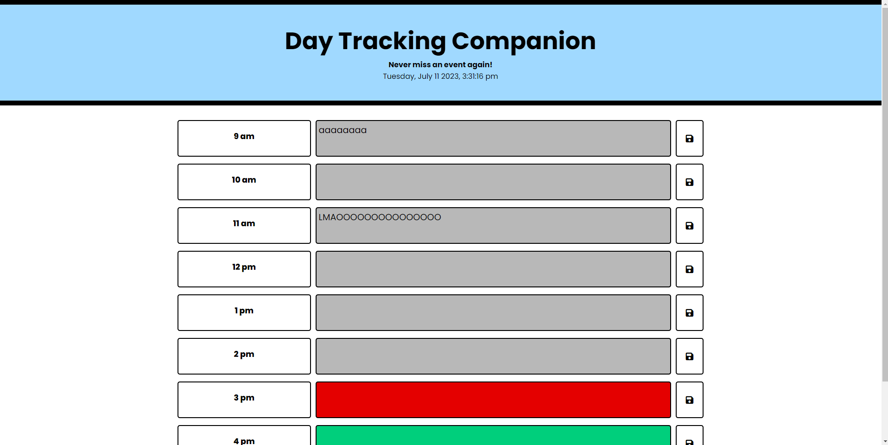

# Day-Planner

## Table of Contents
1. [Description](#Description)
2. [Screenshots](#Screenshots)
3. [Usage](#Usage)
4. [Credits](#credits)

## Description
A day planning website that allows users to input an event at a specific time, and that event is remembered when the user clicks save and refreshes the page.
The current date and time is shown at the top for reference.

## Installation

N/A

## Screenshots

## Usage
The site features a header that shows the current date and time. The main page will show times from 9am to 5pm, and the text area of the current time will be highlighted red. When the user inputs information, and clicks save, the textarea value is saved to localStorage, and then pulled from localStorage when the page is refreshed.
## Credits

Ediubong Ekwere | Juno and Ice

## License

MIT © Juno and Ice